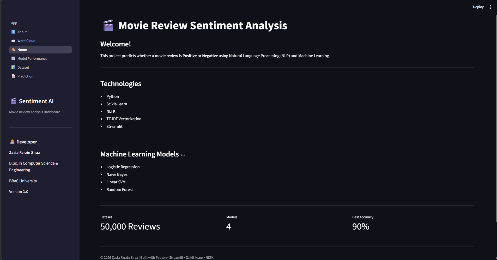
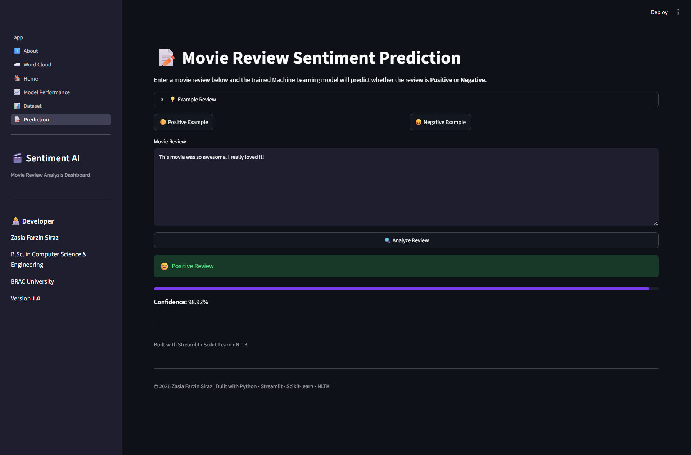
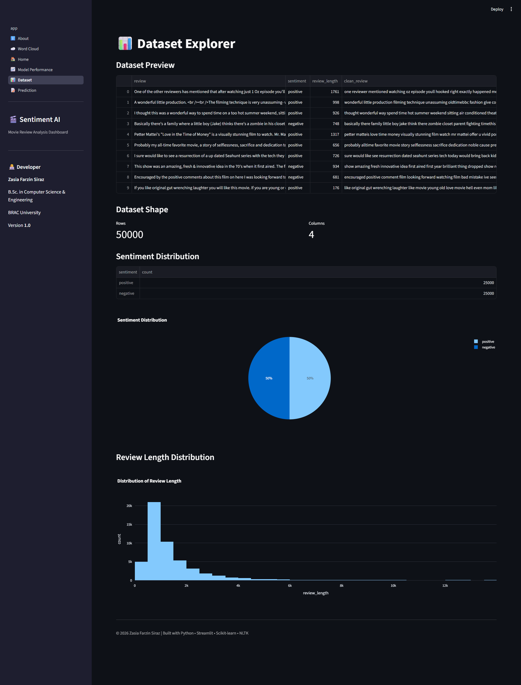
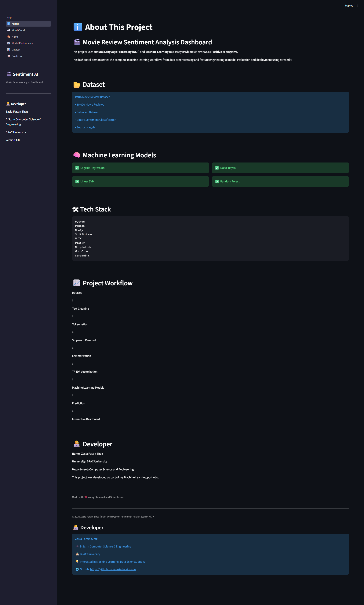

# 🎬 Sentiment Analysis Dashboard

An end-to-end Natural Language Processing (NLP) web application that predicts whether a movie review is **Positive** or **Negative** using Machine Learning.

## 🚀 Live Demo

Coming Soon

## 📌 Features

- ✅ Movie Review Sentiment Prediction
- ✅ Text Preprocessing with NLTK
- ✅ TF-IDF Vectorization
- ✅ Logistic Regression Classifier
- ✅ Interactive Streamlit Dashboard
- ✅ Dataset Explorer
- ✅ Word Cloud Visualization
- ✅ Model Performance Comparison

---

## 🛠 Tech Stack

- Python
- Scikit-learn
- Streamlit
- Pandas
- NumPy
- Plotly
- NLTK
- WordCloud
- Joblib

---

## 📊 Dataset

IMDb Movie Reviews Dataset

- 50,000 Movie Reviews
- Binary Sentiment Classification
- Positive & Negative Reviews

---

## 🤖 Machine Learning Pipeline

1. Data Cleaning
2. Text Preprocessing
3. TF-IDF Vectorization
4. Logistic Regression Training
5. Model Evaluation
6. Streamlit Deployment

---

## 📈 Model

| Algorithm | Accuracy |
|------------|----------|
| Logistic Regression | 89% |

---

## 📸 Screenshots

### Home



### Prediction



### Dataset



### Model Performance


### Word Cloud


### About



---

## ⚙️ Installation

Clone the repository

```bash
git clone https://github.com/zasia-farzin-siraz/Sentiment-Analysis-Dashboard.git
```

Install dependencies

```bash
pip install -r requirements.txt
```

Run

```bash
streamlit run app.py
```

---

## 👨‍💻 Developer

**Zasia Farzin Siraz**

B.Sc. in Computer Science & Engineering

BRAC University

---

## ⭐ If you like this project, consider giving it a star!